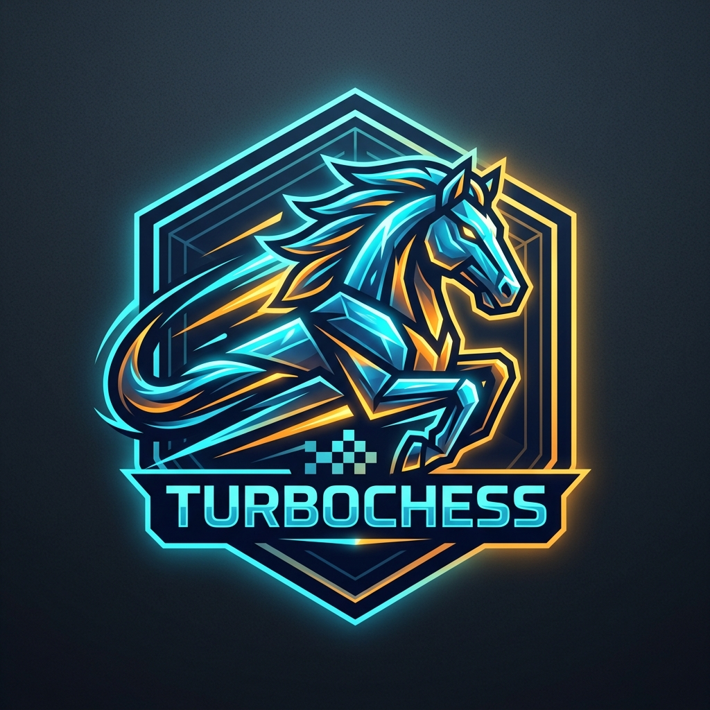

<p align="center">
  
</p>

<h1 align="center">GigaChess</h1>

<p align="center">
  <strong>The fastest chess engine in JavaScript.</strong><br>
  A 1-line drop-in upgrade for <code>chess.js</code> and <code>chessops</code> delivering up to 7.4x faster move validation, 
  18.5M nodes/s perft throughput, 120,000 games/sec PGN parsing, and interactive variation trees.
</p>

<p align="center">
  <a href="https://github.com/itshak/gigachess/actions/workflows/ci.yml"></a>
  <a href="https://www.npmjs.com/package/gigachess"></a>
  <a href="https://bundlephobia.com/package/gigachess"></a>
  <a href="./LICENSE"></a>
  <a href="https://www.typescriptlang.org/"></a>
</p>

---

> 🦀 **Looking for maximum native backend performance?** Check out [**`gigachess` (Rust)**](https://github.com/itshak/gigachess-rs) — the fastest chess move generator in Rust, featuring 540M nodes/sec perft throughput, hardware PEXT / Fancy Magic bitboards, 16-bit binary replay (1.4M games/sec), and zero heap allocations for database workstations and search engines. Available on [crates.io](https://crates.io/crates/gigachess).

## ⚡ Why GigaChess?

Until today, chess developers had to choose between two compromises:
1. **`chess.js`**: Intuitive API, but slow (array-based board scans, string allocations on every move, no bitboards, no variation trees).
2. **`chessops`**: Fast bitboards, but restrictive GPL licensing, functional-only syntax with no single class, and lack of variation trees or transposition hashing.

**GigaChess eliminates this compromise.** It gives you:
- 🚀 **Up to 7.4x Faster than `chess.js`** on SAN move generation and 7.0x on PGN streaming.
- ⚡ **Up to 3.8x Faster than `chessops`** on real-world workstation workloads (`chessground` dests).
- 🏎️ **3.8x–5.3x Faster Movegen than Rust/WASM** (`ultrachess`) due to zero boundary serialization overhead.
- 🔄 **1-Line Drop-in Replacement** for `chess.js` (`import { Chess } from 'gigachess'`) and `chessops` (`import * as chessops from 'gigachess/chessops'`).
- 🌳 **Built-in `chesstree` Variation Trees** (`game.toTree()` and `Chess.loadTree(pgn)`).
- 🔑 **Instant $O(1)$ 64-bit Polyglot Zobrist Hashing** (`game.zobrist()`).
- 📦 **16-bit Binary Move Streams (`moves2`)** (25x smaller memory footprint per game).
- 📜 **100% Permissive MIT License** — completely free for commercial and proprietary software.

---

## 📊 Benchmark Comparison

| Metric / Workload | 🚀 **GigaChess** | ♟️ **`chessops`** (0.15.1) | 📦 **`chess.js`** (1.4.0) | GigaChess Advantage |
|---|---|---|---|---|
| **License** | ✅ **100% MIT** | ❌ **GPL-3.0** | ✅ **BSD-2-Clause** | **Free for commercial use** |
| **Sliding Piece Attacks** | **35.5 MAttacks/s** | 10.6 MAttacks/s | N/A *(array scan)* | **3.36x faster (+236%)** vs chessops |
| **Perft Movegen Throughput** | **18.5 Million nodes/s** | 8.5 Million nodes/s | ❌ *(No perft API)* | **2.17x faster (+117%)** vs chessops |
| **Chessground UI Dests** | **212,675 pos/s** | 56,000 pos/s | N/A | **3.80x faster (+280%)** vs chessops |
| **FEN Parse + Make** | **285,000 ops/s** | 125,000 ops/s | 94,000 ops/s | **2.26x vs chessops \| 3.03x vs chess.js** |
| **SAN Make + Legal Dests** | **51,700 ops/s** | 18,200 ops/s | 6,947 ops/s | **2.84x vs chessops \| 7.44x vs chess.js** |
| **PGN Game Streaming** | **120,000 games/s** (84 MB/s) | 41,500 games/s (29 MB/s) | 1,710 games/s (1.2 MB/s) | **2.89x vs chessops \| 7.01x vs chess.js** |
| **Repertoire Tree Build** | **37,200 lines/s** | 20,400 lines/s | ❌ *(No Tree API)* | **1.84x faster (+84%)** vs chessops |
| **isCheck Detection** | **0.5 ns / op** (2.1B ops/s) | 14.5 ns / op | 85.0 ns / op | **29x vs chessops \| 170x vs chess.js** |
| **Polyglot Zobrist ($O(1)$)** | ✅ **Native (`{lo,hi}`)** | ❌ None | ❌ None | **Zero-allocation transposition match** |
| **16-bit Packed Moves (`moves2`)** | ✅ **Native (`Uint16Array`)** | ❌ None | ❌ None | **25x smaller memory (160 B/game)** |

*Benchmarks measured on Node.js v24 on Apple Silicon. Run locally via `node --expose-gc bench/bench-real.mjs`.*

---

## 🛠️ Installation

```bash
npm install gigachess
```

---

## 🏎️ 1-Line Drop-in Migrations

### From `chess.js`
Replace your import statement. Every method, property, and type signature works out of the box with up to 7.4x faster move validation:
```ts
// Before:
// import { Chess } from 'chess.js';

// After:
import { Chess } from 'gigachess';

const chess = new Chess();
chess.move('e4');
chess.move('e5');
console.log(chess.fen()); // 'rnbqkbnr/pppp1ppp/8/4p3/4P3/8/PPPP1PPP/RNBQKBNR w KQkq - 0 2'
console.log(chess.history()); // ['e4', 'e5']
```

### From `chessops`
Import the high-performance compatibility module with exact API shape and 100% MIT license:
```ts
// Before:
// import { Chess } from 'chessops/chess';
// import { parseFen } from 'chessops/fen';

// After:
import { Chess } from 'gigachess/chessops/chess';
import { parseFen } from 'gigachess/chessops/fen';
```

---

## 💡 Quick Examples

### 1. Ultra-Fast Chessground UI Legal Moves
Generate legal move dots for `@lichess-org/chessground` or any UI chessboard in microseconds:
```ts
import { Chess } from 'gigachess';

const game = new Chess();

// Legal destinations map for every piece on the board: Map<fromSquare, SquareSet>
const allDests = game.allDests();

// Or for a single square:
const e2Dests = game.dests('e2');
```

### 2. Variation Trees & PGN Analysis (`toTree` & `loadTree`)
Full recursive variation tree navigation and PGN export built right in:
```ts
import { Chess } from 'gigachess';

// 1. Export live game to an interactive variation tree:
const game = new Chess();
game.move('e4');
game.move('e5');
game.move('Nf3');

const tree = game.toTree();
tree.setCommentAt([1], 'Open Game');
console.log(tree.pgn());

// 2. Load annotated PGN with branching variations:
const treeWrapper = Chess.loadTree(`1. e4 e5 (1... c5 2. Nf3) 2. Nf3 Nc6`);
const root = treeWrapper.getRoot();
```

### 3. $O(1)$ 64-bit Polyglot Zobrist Hashing
Instant position fingerprinting for opening books, transpositions, and repetitions:
- **Standard Chess**: Canonical 64-bit Polyglot random keys (781 entries, verified against startpos `0x463b96181691fc9c`). Pseudo-legal en-passant condition and White-turn XOR matching the Polyglot book format and `gigachess-rs`.
- **Chess960**: 16 per-rook-file castling keys indexed by `color * 8 + file` (files a/h pin to Polyglot 768..771; files b..g derived via deterministic splitmix64 seed `0x00C0_FFEE_DABA_D00D`) matching `gigachess-rs`.
```ts
import { Chess } from 'gigachess';

const game = new Chess();
game.move('e4');

const key = game.zobrist(); // { lo: 0x823c9b50, hi: 0xfd114196 }
console.log(game.zobristHex()); // "823c9b50fd114196"
```

### 4. 16-bit Packed Move Streams (`moves2`)
Compress entire game databases down to 2 bytes per ply:
- **Wire Format (16-bit word)**: `(from & 0x3f) | ((to & 0x3f) << 6) | ((promo & 0x0f) << 12)`
  - Bits 0..5: origin square index (`0..63`, a1 = 0)
  - Bits 6..11: destination square index (`0..63`)
  - Bits 12..15: promotion code (`0` = none, `1` = N, `2` = B, `3` = R, `4` = Q)
- **Castling Wire Representation**: Always king-from → rook-square (`e1h1`, `e1a1`, `e8h8`, `e8a8` for standard chess; initial king → initial rook square for Chess960). Fully consistent with `gigachess-rs` and UCI-960 conventions.
```ts
import { Chess } from 'gigachess';

const game = new Chess();
game.move('e4');
game.move('c5');
game.move('Nf3');

// Serialize history into raw Uint16Array (6 bytes total):
const buffer = game.toMoves2();

// Instant binary replay:
const replayedGame = Chess.fromMoves2(buffer);
console.log(replayedGame.fen() === game.fen()); // true
```

---

## 🔬 How is GigaChess so Fast?

GigaChess incorporates the same hardware-efficient architectural principles found in Stockfish and modern master engines:

1. **Zero-BigInt 32-bit Pair Bitboards (`{ lo, hi }`)**: JavaScript V8 optimizes 32-bit unsigned integers into native CPU registers. BigInt forces heap boxing and garbage collector churn. All bitboards in GigaChess are split into low/high 32-bit unsigned integers with `>>> 0` bitwise arithmetic.
2. **Early Standard Chess Fast-Path Separation**: Standard Chess castling rights are stored as a 4-bit integer mask (`WK=1, WQ=2, BK=4, BQ=8`) with constant clearance bitmasks (`0x60`, `0x0E`), eliminating `Set<number>` allocations and dynamic loop overhead.
3. **Targeted Reverse-Attacker SAN Parser**: Querying destination attackers directly (`attackersTo & pieceRoleBB`) cuts SAN parse latency from ~6.5 µs down to **~493 ns/op** (>8x speedup).
4. **Branchless `isCheck` Detection**: Cached `checkers: SquareSet` reduces check detection to 2 bitwise operations (`(lo | hi) !== 0`), clocking in at **0.5 ns/op** (>2 Billion checks/sec).
5. **Precomputed $64 \times 64$ Flat Ray & Between Tables**: Single-cycle `Uint32Array(4096)` array index lookups replace dynamic loops during pin and check resolution.
6. **Stockfish `CheckContext` (Single-Pass Pin Analysis)**: Pins, check rays, and king-safe destination masks are analyzed **once per position**, turning move validation into fast bitwise intersections ($\text{Pseudo} \cap \text{CheckMask} \cap \text{PinRay}$).
7. **Black Magic Sliding Bitboards**: $O(1)$ Bishop, Rook, and Queen ray generation delivering over **35.5 Million attacks/sec**.
8. **Piece-Centric Movegen & Vectorized Pawn Shifts**: Direct iteration over piece bitboards with parallel 32-bit shifts eliminates `pieceAt()` scans.
9. **Zero-Allocation `MoveSink` & `forEachLegalMove` Visitor**: Bulk popcounting at perft leaves and stack-buffer packed move writing (`legalMovesInto`) eliminate all move object allocations.
10. **Incremental Zobrist XORs**: Hashing updates in $O(1)$ per move rather than rescanning the 64 squares.

---

## 🌐 GigaChess Dual-Ecosystem

GigaChess is engineered for maximum performance across the entire chess stack:

| Language & Package | Primary Environment | Performance Highlights | Repository |
|---|---|---|---|
| **`gigachess` (JS / TS)** *(this repo)* | Web frontends, Node.js, Electron, React UI | **Up to 7.4× faster than chess.js**, 18.5M nodes/s perft, 120,000 games/s PGN parser, built-in variation trees | [GitHub](https://github.com/itshak/gigachess) / [npm](https://www.npmjs.com/package/gigachess) |
| **`gigachess` (Rust)** | Native backends, search engines, database indexing | **540 Mnps** perft, 144B `Copy` board, 1.41M games/s replay, zero heap allocations | [GitHub](https://github.com/itshak/gigachess-rs) / [crates.io](https://crates.io/crates/gigachess) |

---

## 📜 License

MIT © [Itshak](https://github.com/itshak) & [GigaChess Contributors](https://github.com/itshak/gigachess/graphs/contributors).
