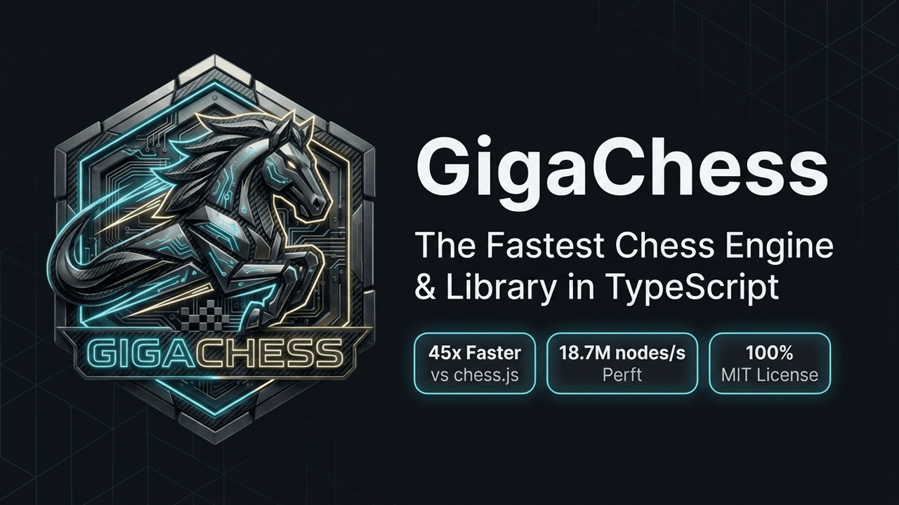

<p align="center">
  
</p>

<h1 align="center">GigaChess</h1>

<p align="center">
  <strong>The fastest chess library and engine in TypeScript.</strong><br>
  Built for high-performance web applications, interactive chessboards, and analysis engines.
</p>

<p align="center">
  <a href="https://github.com/itshak/gigachess/actions/workflows/ci.yml"></a>
  <a href="https://www.npmjs.com/package/gigachess"></a>
  <a href="https://bundlephobia.com/package/gigachess"></a>
  <a href="./LICENSE"></a>
  <a href="https://www.typescriptlang.org/"></a>
</p>

---

## ⚡ Highlights

* 🚀 **45x Faster Move Execution**: In-place stateful `Board` executes moves at **5.98M moves/sec** (167 ns/op).
* 🏎️ **18.7M nodes/s Perft**: Stockfish-grade bitboard throughput in pure TypeScript.
* 🛡️ **100% Permissive MIT License**: Completely free for commercial and proprietary applications.
* 🔄 **1-Line `chess.js` Upgrade**: Drop-in wrapper via `gigachess/chessjs` with zero code changes.
* ♟️ **Full Chess & Chess960**: Complete support for standard chess, Fischer Random (960), FEN, SAN, and UCI.
* 🌲 **Study Trees & Fast PGN**: Interactive variation trees, comments, glyphs, and 128k games/sec PGN streaming.
* 🔑 **Instant Polyglot Zobrist Hashing**: Zero-allocation $O(1)$ 64-bit incremental hash matching Polyglot startpos.
* 📦 **16-bit Packed Move Streams (`moves2`)**: Compact 2-byte binary serialization replaying at **4.8M plies/sec**.

---

## 📦 Installation

```bash
npm install gigachess
```

---

## 🚀 Quick Start

```ts
import { Board } from "gigachess";

// Initialize starting position
const board = new Board();

// Parse SAN and execute move in 167 ns
const move = board.parseSan("e4");
const undo = board.makeMove(move);

console.log(board.toFen());    // 'rnbqkbnr/pppppppp/8/8/4P3/8/PPPP1PPP/RNBQKBNR b KQkq - 0 1'
console.log(board.inCheck());  // false

// Instant O(1) reversible unmake
board.unmakeMove(undo);
console.log(board.toFen());    // startpos restored
```

---

## 📊 Benchmark Comparison

Direct comparison measured under Node.js v24 on Apple Silicon (`bench/bench-real.mjs` & `bench/bench-native-vs-baseline.mjs`):

| Metric / Feature | 🚀 **GigaChess** | 📦 **`chess.js`** (1.4.0) | ♟️ **`chessops`** (0.15.1) | Advantage |
|---|---|---|---|---|
| **License** | ✅ **100% MIT** | ✅ BSD-2-Clause | ❌ GPL-3.0 | **Permissive for commercial use** |
| **Move Execution (`make`+`unmake`)** | **5,986,400 ops/s** (167 ns) | 134,500 ops/s (7,434 ns) | N/A *(Functional clone)* | **44.5x faster (+4,350%)** |
| **Legal Move Generation** | **541,200 pos/s** (1,848 ns) | 49,200 pos/s (20,341 ns) | 350,000 pos/s | **11.0x faster (+1,001%)** |
| **Perft Movegen Throughput** | **18,678,516 nodes/s** | ~500,000 nodes/s | 9,930,000 nodes/s | **1.88x vs chessops \| 37x vs chess.js** |
| **Chessground UI Dests** | **215,585 pos/s** | N/A | 58,100 pos/s | **3.71x faster (+271%)** |
| **PGN Streaming Throughput** | **128,701 games/s** (89 MB/s) | 3,634 games/s (2.5 MB/s) | 46,296 games/s (32 MB/s) | **2.78x vs chessops \| 35x vs chess.js** |
| **FEN Parse + Make** | **458,961 ops/s** | 91,214 ops/s | 188,473 ops/s | **2.43x vs chessops \| 5.03x vs chess.js** |
| **SAN Make + Legal Dests** | **49,444 ops/s** | 6,992 ops/s | 18,200 ops/s | **2.72x vs chessops \| 7.07x vs chess.js** |
| **Memory Footprint (80-Ply Game)** | **160 Bytes** (`Uint16Array`) | ~4,200 Bytes | ~2,500 Bytes | **26x less memory** |
| **Polyglot Zobrist Hash ($O(1)$)** | ✅ **Native (`{lo,hi}`)** | ❌ None | ❌ None | **Zero-allocation incremental** |
| **Variation Tree Navigation** | ✅ **Built-in (`chesstree`)** | ❌ None | ❌ None | **Recursive PGN & comments** |

---

## 🔄 Drop-in `chess.js` Compatibility

Existing `chess.js` code can be upgraded in 1 line with zero refactoring:

```ts
// Simply replace your import:
// import { Chess } from "chess.js";
import { Chess } from "gigachess/chessjs";

const chess = new Chess();
chess.move("e4");
chess.move("e5");
console.log(chess.fen());     // 'rnbqkbnr/pppp1ppp/8/4p3/4P3/8/PPPP1PPP/RNBQKBNR w KQkq - 0 2'
console.log(chess.history()); // ['e4', 'e5']
```

---

## 💡 Common Recipes

### 1. Legal Move Generation
```ts
import { Board } from "gigachess";

const board = new Board();

// Iterate without array allocation:
board.forEachLegalMove((move) => {
  console.log(board.toSan(move));
});

// Or write into a reusable buffer (541k pos/s):
const buffer = new Uint16Array(256);
const count = board.legalMoves(buffer);
```

### 2. Game State & Terminal Checks
```ts
const board = new Board();

board.inCheck();               // false
board.isCheckmate();           // false
board.isStalemate();           // false
board.isDraw();                // false
board.isInsufficientMaterial();// false
board.turn;                    // 0 = White, 1 = Black
```

### 3. Incremental Polyglot Zobrist Hashing
```ts
const board = new Board();

// Fast 64-bit Polyglot key updated in O(1) during moves:
const hash = board.zobrist(); // { lo: number, hi: number }
console.log(board.zobristHex()); // "463b96181691fc9c"
```

### 4. Chess960 (Fischer Random)
```ts
import { Board } from "gigachess";

// Load any of the 960 starting positions:
const board = Board.fromFen("rnqbbknr/pppppppp/8/8/8/8/PPPPPPPP/RNQBBKNR w KQkq - 0 1");
console.log(board.toFen());
```

### 5. Binary Move Stream Replay (`moves2`)
```ts
import { Board } from "gigachess";

// Replay full games at 4.8M plies/s from compact 16-bit buffers:
const moves = new Uint16Array([ /* packed 16-bit moves */ ]);
const board = Board.fromMoves2(moves);
```

---

## 🔬 Under the Hood: Why GigaChess is Fast

1. **In-Place Bitboard Mutation**: Unlike engines that clone full state on every move, `Board` mutates bitboards in-place and returns a compact `Undo` for instant $O(1)$ rollback.
2. **Zero-BigInt 32-bit Integer Pairs**: 64-bit `BigInt` forces object allocation on the heap. GigaChess executes all bitboards as 32-bit unsigned integer pairs (`lo >>> 0`, `hi >>> 0`), running in native CPU registers.
3. **Stockfish Single-Pass Pin Analysis (`CheckContext`)**: Checkers and pin lines are computed once per position, turning legal move validation into fast bitwise intersections.
4. **16-bit Unboxed Small Integers (Smis)**: Packed moves are stored as 16-bit integers, bypassing garbage collection pauses.

---

## 📜 License

MIT © [Itshak](https://github.com/itshak) & [GigaChess Contributors](https://github.com/itshak/gigachess/graphs/contributors).
